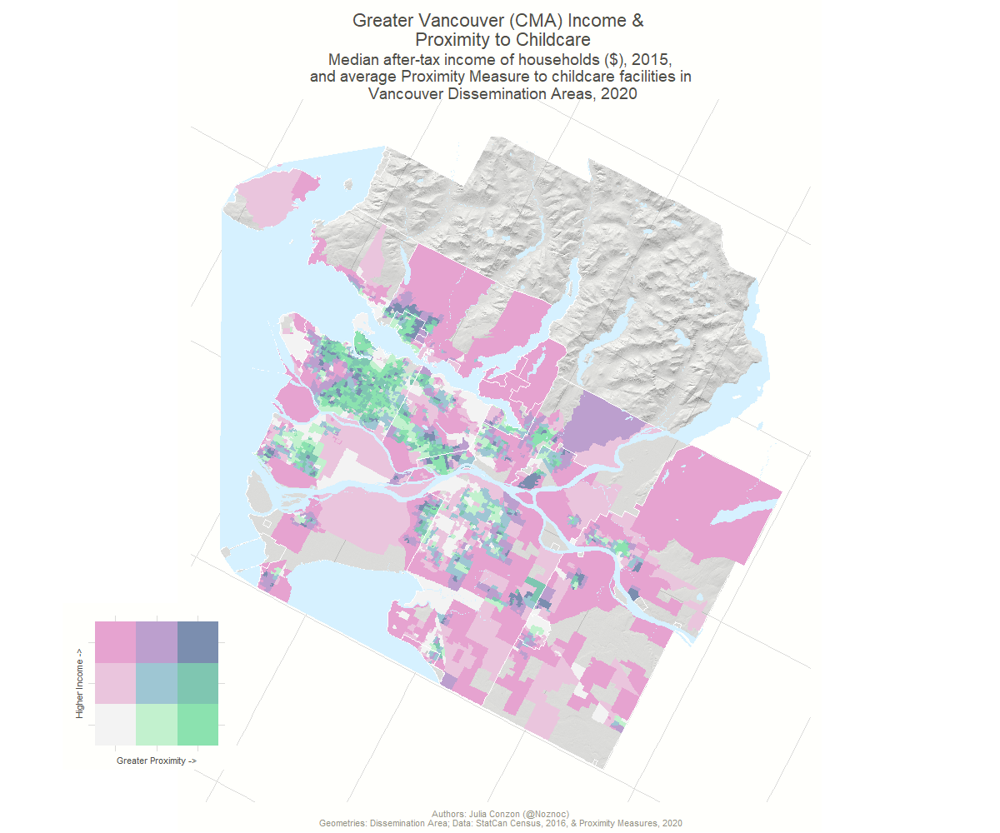
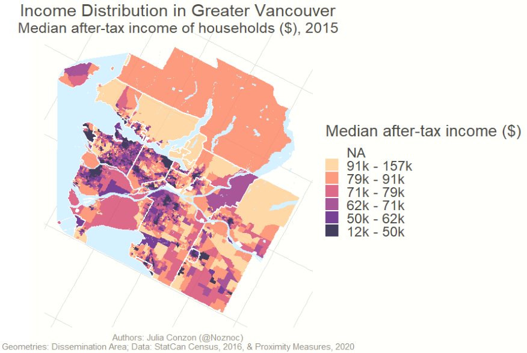

Bivariate maps with ggplot2 and sf
===========================================

Scripts and tutorial are modified from Timo Grossenbacher and Angelo Zehr. Their original [GitHub](https://github.com/grssnbchr/bivariate-maps-ggplot2-sf) has the source code they worked on to develop these beautiful maps for a news article in Switzerland. They also have a [blog](https://timogrossenbacher.ch/2019/04/bivariate-maps-with-ggplot2-and-sf). Their work has been modified for a Canadian context. For this tutorial, you will learn how to make static maps with ggplot2 and sf, using the following data: (1) Statistics Canada Census 2016 Dissemination Area boundaries; (2) income statistics from Census 2016; (3) Centre for Special Business Project's Proximity Measures; (4) BC Digital Elevation Models (DEM). Details on these data sources are provided later.

License concerning the code and the maps produced: **CC-BY-SA**.