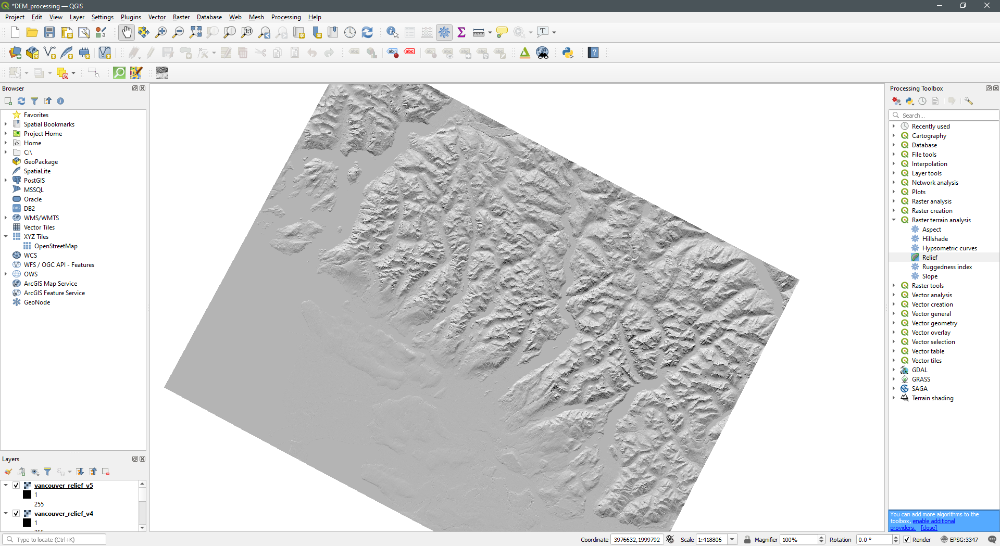

Scripts and tutorial are modified from Timo Grossenbacher and Angelo Zehr. Their original [GitHub](https://github.com/grssnbchr/bivariate-maps-ggplot2-sf) has the source code they worked on to develop these beautiful maps for a news article in Switzerland. Their work has been modified for a Canadian context. For this tutorial, you will learn how to make static maps with ggplot2 and sf, using the following data: (1) Statistics Canada Census 2016 Dissemination Area boundaries; (2) income statistics from Census 2016; (3) Centre for Special Business Project's Proximity Measures; and (4) BC Government Digital Elevation Models (DEM). Details on these data sources are provided later. 

### License

**Creative Commons license (CC-BY-SA)**

### Version information

The following scripts can work for R version 3.5 to 4.

## Preparations

### Constant Variables

```{r preparations, echo=TRUE, message=FALSE, warning=FALSE}
# constants
default_font_color <- "#4e4d47"
default_background_color <- "#fffffc"
default_font_family <- "Helvetica-Narrow"
default_caption <- paste0("Authors: Julia Conzon",
                          " (@Noznoc)",
                          "\nGeometries: Dissemination Area;",
                          " Data: StatCan Census, 2016, & Proximity Measures, 2020")
```

### Define packages

For this project, we use `tidyverse` packages including `ggplot2` for plotting, `sf` for geodata processing and `raster` for working with (spatial) raster data, i.e. the relief. Also, the `viridis` package imports the beautiful Viridis color scale we use for the univariate map. Lastly, `cowplot` is used to combine the bivariate map and its custom legend. You might need to install these packages prior to reading them.

```{r, echo=TRUE, message=FALSE, warning=FALSE}
library(rstudioapi)
library(tidyverse) # ggplot2, dplyr, tidyr, readr, purrr, tibble
library(lintr) # code linting
library(sf) # spatial data handling
library(raster) # raster handling (needed for relief)
library(viridis) # viridis color scale
library(cowplot) # stack ggplots
library(rmarkdown)
```

## Data Sources

### Thematic Data

First, read the thematic data that will be visualized. It is contained in a CSV that was prepared in `data_processing.R` from various Statistics Canada (StatCan) sources (detailed in `data_processing.R`). The main columns to note for this tutorial are the following:

* `GEO_CODE (POR)` (which have been reduced to DAUIDs within the `data_processing.R` script), 
* `Dim: Sex (3): Member ID: [1]: Total - Sex` (which represents the "Median after-tax income of households in 2015 ($)" Census Profile 2016 variable for total sex per each DA),
* `prox_idx_childcare` (the Proximity Measures indicators of spatial access to various services/amenities. For this tutorial, childcare has been selected.)

```{r read data, echo=TRUE, message=FALSE, warning=FALSE}
# Since Proximity Measures is at the Dissemination Block geographic boundary level, the values were aggregated to the DA level by average value. For tutorial demonstration, this was deemed appropriate, but values represented in the visualization could be misleading.
data <- read_csv("./data/data.csv", na = "..", guess_max=15000) %>% 
  group_by(`GEO_CODE (POR)`) %>% 
  summarise(prox_idx_childcare_mean = median(as.numeric(na.omit(prox_idx_childcare))), income_median = max(as.numeric(na.omit(`Dim: Sex (3): Member ID: [1]: Total - Sex`))))
``` 

### Geodata

Various geodata from StatCan and the British Columbia government are used herein.

* `lda_000b16a_e/lda_000b16a_e.*`: The StatCan Dissemination Area (DA) shapefile boundaries for all of Canada. You will need to download them as a shapefile from the StatCan website: https://www150.statcan.gc.ca/n1/en/catalogue/92-169-X. DA are a very low geographic unit, so you can aggregate them to other larger boundaries, like the Census Subdivision (CSD) or Census Metropolitan Areas (CMA), as seen below.
* (Hillshaded) relief: From [BC Provincial Government](https://pub.data.gov.bc.ca/datasets/175624/92g/), you can download Digital Elevation Models (DEMs), raster data representing elevation, for all of BC. For the sake of simplicity, DEMs were merged and processed to visualize hillshaded relief in QGIS prior to this tutorial (seen in image below). It was then converted to the "ESRI ASCII" format using GDAL command line: ` gdal_translate -of AAIGrid relief-vancouver.tif relief-vancouver.asc`.
* `data/waterways/vancouver_waterways.shp`: Merged StatCan [coastal](https://www12.statcan.gc.ca/census-recensement/alternative_alternatif.cfm?l=eng&dispext=zip&teng=lhy_000h16a_e.zip&k=%20%20%20%2041333&loc=http://www12.statcan.gc.ca/census-recensement/2011/geo/bound-limit/files-fichiers/2016/lhy_000h16a_e.zip), [lake and river](https://www12.statcan.gc.ca/census-recensement/alternative_alternatif.cfm?l=eng&dispext=zip&teng=lhy_000c16a_e.zip&k=%20%20%20143102&loc=http://www12.statcan.gc.ca/census-recensement/2011/geo/bound-limit/files-fichiers/2016/lhy_000c16a_e.zip) waterway polygons were clipped to Vancouver CMA Convex Hull. This was also completed in QGIS.

(NOTE: As much as R can offer a lot of geoprocessing functionalities, exploring and testing geoprocessing on large data files like all DEMs in BC or all waterways in Canada can be more easily handled in QGIS. However, this does break a reproducible workflow.)



```{r read in geodata, echo=FALSE, message=FALSE, warning=FALSE}

# make CMA border from DA geometries
cma <- read_sf("./data/lda_000b16a_e/lda_000b16a_e.shp") %>% 
  filter(CMAUID == "933") %>% 
  group_by(CMAUID) %>% summarize()

# read waterways
waterways <- read_sf("./data/waterways/vancouver_waterways.shp")

# read DA geometries and filter to just Vancouver CMA (CMAUID = 933)
da <- read_sf("./data/lda_000b16a_e/lda_000b16a_e.shp") %>% 
  filter(CMAUID == "933")

# read DA geometries and filter to just Vancouver CMA (CMAUID = 933) then dissolve to make polygons of just CSDs
csd <- read_sf("./data/lda_000b16a_e/lda_000b16a_e.shp") %>% 
  filter(CMAUID == "933") %>% 
  group_by(CSDUID) %>% summarize()

# read in raster of relief
relief <- raster("./data/DEM/vancouver_relief_v5.asc") %>%
  mask(cma) %>% 
  as("SpatialPixelsDataFrame") %>%
  as.data.frame()

```

### Join Geodata with Thematic Data

In the following chunk, the DA geodata is extended (joined) with the thematic data (i.e., median income and mean proximity) over each DA's unique identifier, so we end up with a data frame consisting of the thematic data as well as the geometries. Note that the class of this resulting object is still `sf` as well as `data.frame`.

```{r join data into shapefiles, echo=TRUE, message=FALSE, warning=FALSE}
data$`GEO_CODE (POR)` <- as.character(data$`GEO_CODE (POR)`)
da <- da %>% 
  left_join(data, by = c("DAUID" = "GEO_CODE (POR)"))
class(da)
```

## Define a Map Theme

Define a unique theme for the map, e.g. remove all axes, add a subtle grid (that you might not be able to see on a bright screen) etc. The original tutorial mostly copied this from [another of Timo's blog posts](https://timogrossenbacher.ch/2018/03/categorical-spatial-interpolation-with-r/). 

```{r define map theme, echo=TRUE, message=FALSE, warning=FALSE}

theme_map <- function(...) {
  theme_minimal() +
  theme(
    text = element_text(family = default_font_family,
                        color = default_font_color),
    # remove all axes
    axis.line = element_blank(),
    axis.text.x = element_blank(),
    axis.text.y = element_blank(),
    axis.ticks = element_blank(),
    # add a subtle grid
    panel.grid.major = element_line(color = "#dbdbd9", size = 0.2),
    panel.grid.minor = element_blank(),
    # background colors
    plot.background = element_rect(fill = default_background_color,
                                   color = NA),
    panel.background = element_rect(fill = default_background_color,
                                    color = NA),
    legend.background = element_rect(fill = default_background_color,
                                     color = NA),
    # borders and margins
    plot.margin = unit(c(.5, .5, .2, .5), "cm"),
    panel.border = element_blank(),
    panel.spacing = unit(c(-.1, 0.2, .2, 0.2), "cm"),
    # titles
    legend.title = element_text(size = 11),
    legend.text = element_text(size = 9, hjust = 0,
                               color = default_font_color),
    plot.title = element_text(size = 15, hjust = 0.5,
                              color = default_font_color),
    plot.subtitle = element_text(size = 10, hjust = 0.5,
                                 color = default_font_color,
                                 margin = margin(b = -0.1,
                                                 t = -0.1,
                                                 l = 2,
                                                 unit = "cm"),
                                 debug = F),
    # captions
    plot.caption = element_text(size = 7,
                                hjust = .5,
                                margin = margin(t = 0.2,
                                                b = 0,
                                                unit = "cm"),
                                color = "#939184"),
    ...
  )
}
```

## Create a Univariate Choropleth

First, let's create a standard (univariate) choropleth map based on the median income alone, i.e. the `income` variable. 

1. Calculate quantiles from the median income to form 6 different classes of median income (quantiles are used so each color class contains approximately the same amount of DAs). From this, we generate a new variable `income_quantiles` which is actually visualized on the map. We also generate custom labels for the classes.

2. We generate and draw the `ggplot2` object as follows:

  * Specify the main data source.
  * OPTIONAL: Add the relief through a call to `geom_raster()`.
  * OPTIONAL: Add a truncated alpha scale for the relief, as the "fill" aesthetic is already taken (refer to [this section](https://timogrossenbacher.ch/2016/12/beautiful-thematic-maps-with-ggplot2-only/#relief) for an explanation).
  * Use `geom_sf()` without an additional data argument to specify the main fill aesthetic (the visual variable showing the median income per DA) and to visualize DA borders.
  * Add the Viridis color scale for that fill aesthetic.
  * Use two more `geom_sf()` calls to add CSD borders and waterways stemming from the `csd` and `waterways` datasets, respectively.
  * Add titles and subtitles.
  * Specify the previously defined map theme.

```{r thematic-univariate-map, echo=TRUE, message=FALSE, warning=FALSE}
# define number of classes
no_classes <- 6

# extract quantiles
quantiles <- da %>%
  pull(income_median) %>%
  quantile(probs = seq(0, 1, length.out = no_classes + 1), na.rm = TRUE) %>%
  as.vector() # to remove names of quantiles, so idx below is numeric

# here we create custom labels for the legend
labels <- imap_chr(quantiles, function(., idx){
  return(paste0(round(quantiles[idx] / 1000, 0),
                             "k",
                             " - ",
                             round(quantiles[idx + 1] / 1000, 0),
                             "k"))
})

# we need to remove the last label 
# because that would be something like "478k - NA"
labels <- labels[1:length(labels) - 1]

# here we actually create a new 
# variable on the dataset with the quantiles
da <- da %>%
  mutate(mean_quantiles = cut(income_median,
                               breaks = quantiles,
                               labels = labels,
                               include.lowest = T))

ggplot(
  # define main data source
  data = da
) +
  # OPTIONAL: draw the relief
  # geom_raster(
  #   data = relief,
  #   inherit.aes = FALSE,
  #   aes(
  #     x = x,
  #     y = y,
  #     alpha = layer
  #   )
  # ) +
  # use the "alpha hack" (as the "fill" aesthetic is already taken)
  scale_alpha(name = "",
              range = c(0.7, 0),
              guide = F) + # suppress legend
  # add main fill aesthetic
  # use thin white stroke for DA borders
  geom_sf(
    mapping = aes(
      fill = mean_quantiles
      ),
    color = NA # units are too small for border, otherwise can add color="white", size=1
  ) +
  # use the Viridis color scale
  scale_fill_viridis(
    option = "magma",
    name = "Median after-tax income ($)",
    alpha = 0.8, # make fill a bit brighter
    begin = 0.1, # this option seems to be new (compared to 2016):
    # with this we can truncate the
    # color scale, so that extreme colors (very dark and very bright) are not
    # used, which makes the map a bit more aesthetic
    end = 0.9,
    discrete = T, # discrete classes, thus guide_legend instead of _colorbar
    direction = 1, # dark is lowest, yellow is highest
    guide = guide_legend(
     keyheight = unit(5, units = "mm"),
     title.position = "top",
     reverse = T # display highest income on top
  )) +
  # use thicker white stroke for CSD borders
  geom_sf(
    data = csd,
    fill = "transparent",
    color = "white",
    size = 1
  ) +
  # draw waterways in light blue
  geom_sf(
    data = waterways,
    fill = "#D6F1FF",
    color = "transparent"
  ) +
  # add titles
  labs(x = NULL,
         y = NULL,
         title = "Income Distribution in Greater Vancouver",
         subtitle = "Median after-tax income of households ($), 2015",
         caption = default_caption) +
  # add theme
  theme_map()
```

## Create a Bivariate Choropleth

Now, let's create the bivariate map. For this, we first specify a bivariate color scale. Then we draw the map with basically the same logic as for the univariate map. (There are scripts for custom annotation, but they are commented out for this specific tutorial, feel free to uncomment and modify as you wish!) Lastly, we come up with a possible design of a legend and add that to the overall plot in the end. 

### Create the Bivariate Color Scale

[Joshua Stevens](http://www.joshuastevens.net/cartography/make-a-bivariate-choropleth-map/) has a nice write-up on how to create the color codes for a sequential bivariate color scheme. He also gives some background on readability and accessibility of such maps. Please checkout his blog to learn more about bivariate color schemes. This GIF from Joshua's blog nicely shows the process of blending the two scales:


To match the 9 different colors with appropriate classes, we calculate 1/3-quantiles for both variables.

```{r prepare bivariate color scale, echo=TRUE, message=FALSE, warning=FALSE}

# create 3 buckets for mean childcare proximity measure
data$prox_idx_childcare_mean <- as.numeric(data$prox_idx_childcare_mean)
quantiles_pmd <- data %>%
  pull(prox_idx_childcare_mean) %>%
  quantile(probs = seq(0, 1, length.out = 4), na.rm = TRUE)

# create 3 buckets for median income
quantiles_income <- data %>%
  pull(income_median) %>%
  quantile(probs = seq(0, 1, length.out = 4), na.rm = TRUE)

# create color scale that encodes two variables
# green for pmd and pink for median income
# the special notation with gather is due to readibility reasons
bivariate_color_scale <- tibble(
  "3 - 3" = "#7B8EAF", # high proximity, high income
  "2 - 3" = "#BC9FCE",  
  "1 - 3" = "#E6A3D0", # low proximity, high income
  "3 - 2" = "#7FC6B1", 
  "2 - 2" = "#9EC6D3", # medium proximity, medium income
  "1 - 2" = "#EAC5DD",  
  "3 - 1" = "#8BE2AF", # high proximity, low income
  "2 - 1" = "#C2F1CE",
  "1 - 1" = "#F3F3F3" # low proximity, low income
) %>%
  gather("group", "fill")

```


### Join Color Codes to the Data

Here the DAs are put into the appropriate class corresponding to their median income and proximity.

```{r join color codes bivariate, echo=TRUE, message=FALSE, warning=FALSE}
# cut into groups defined above and join fill
da <- da %>%
  mutate(
    pmd_quantiles = cut(
      as.numeric(prox_idx_childcare_mean),
      breaks = quantiles_pmd,
      include.lowest = TRUE
    ),
    income_quantiles = cut(
      income_median,
      breaks = quantiles_income,
      include.lowest = TRUE
    ),
    # by pasting the factors together as numbers we match the groups defined
    # in the tibble bivariate_color_scale
    group = paste(
      as.numeric(pmd_quantiles), "-",
      as.numeric(income_quantiles)
    )
  ) %>%
  # we now join the actual hex values per "group"
  # so each DA knows its hex value based on the his pmd and median
  # income value
  left_join(bivariate_color_scale, by = "group")

```

### Draw the Map

As said above, this is basically the same approach as in the univariate case, except for the custom legend and annotations.

#### OPTIONAL: Annotations

Adding the annotations is a bit cumbersome because the `curvature` and `nudge_*` arguments cannot be specified as data-driven aesthetics for `geom_curve()` and `geom_text()`, respectively. However, we need them to be data-driven, as we don't want to specify the same curvature for all arrows, for example. For this reason we need to save all annotations into a separate data frame. We then call `geom_curve()` and `geom_text()` separately for each annotation to specify dynamic `curvature` and `nudge_*` arguments.

(NOTE: The following script is from the original tutorial and has not been modified, thus colours and variables names do not align with the rest of this modified tutorial.)

```{r define annotation data frame, echo=TRUE, message=FALSE, warning=FALSE}
# annotations <- tibble(
#   label = c(
#     "Grey areas mean\nlow income and\nlow inequality",
#     "Blue areas mean\nhigh income and\nlow inequality",
#     "Violet areas mean\nhigh income and\nhigh inequality",
#     "Red areas mean\nlow income and\nhigh inequality"
#   ),
#   arrow_from = c(
#     "548921,232972", # grey
#     "771356,238335", # blue
#     "781136,125067", # violet
#     "616348,81869" # red
#   ),
#   arrow_to = c(
#     "622435,206784", # grey
#     "712671,261998", # blue
#     "786229,149597", # violet
#     "602334,122674" # red
#   ),
#   curvature = c(
#     0.2, # grey
#     0.1, # blue
#     -0.1, # violet
#     -0.2 # red
#   ),
#   nudge = c(
#     "-3000,0", # grey
#     "3000,5000", # blue
#     "0,-5000", # violet
#     "3000,0" # red
#   ),
#   just = c(
#     "1,0", # grey
#     "0,1", # blue
#     "0.5,1", # violet
#     "0,1" # red
#   )
# ) %>%
#   separate(arrow_from, into = c("x", "y")) %>%
#   separate(arrow_to, into = c("xend", "yend")) %>%
#   separate(nudge, into = c("nudge_x", "nudge_y"), sep = "\\,") %>%
#   separate(just, into = c("hjust", "vjust"), sep = "\\,")

```

#### Prepare the Map

* Specify a basic map `ggplot2` object, following the same order as in the univariate case (we use `scale_fill_identity()` instead of the Viridis color scale).
* OPTIONAL: We then loop over each row of the `annotations` data frame and add each annotation (`geom_curve()` and `geom_text()` calls) to the `map` object one by one. (NOTE: This has been commented out in the script below.)
  * Note that we need to manually specify the font family for the labels again.

```{r specify the bivariate map with annotations, echo=TRUE, message=FALSE, warning=FALSE}
map <- ggplot(
  # use the same dataset as before
  data = da
  ) +
  # first: draw the relief
  geom_raster(
    data = relief,
    aes(
      x = x,
      y = y,
      alpha = layer
    )
  ) +
  # use the "alpha hack" (as the "fill" aesthetic is already taken)
  scale_alpha(name = "",
              range = c(0.6, 0),
              guide = F) + # suppress legend
  # color DAs according to their pmd / income combination
  geom_sf(
    aes(
      fill = fill
    ),
    # use thin white stroke for DAs
    color = NA #"white",
    # size = 0.00001
  ) +
  # as the sf object da has a column with name "fill" that
  # contains the literal color as hex code for each DA, we can use
  # scale_fill_identity here
  scale_fill_identity() +
  # use thicker white stroke for CSDs
  geom_sf(
    data = csd,
    fill = "transparent",
    color = "white",
    size = 0.7
  ) +
  # draw waterways in light blue
  geom_sf(
    data = waterways,
    fill = "#D6F1FF",
    color = "transparent"
  ) +
  # add titles
  labs(x = NULL,
         y = NULL,
         title = "Greater Vancouver (CMA) Income & \n Proximity to Childcare",
         subtitle = paste0("Median after-tax income of households ($), 2015,\n and",
                           " average Proximity Measure to childcare facilities in \n Vancouver Dissemination Areas, 2020"),
         caption = default_caption) +
  # add the theme
  theme_map()

# add annotations one by one by walking over the annotations data frame
# this is necessary because we cannot define nudge_x, nudge_y and curvature
# in the aes in a data-driven way like as with x and y, for example
# annotations %>%
#   pwalk(function(...) {
#     # collect all values in the row in a one-rowed data frame
#     current <- tibble(...)
# 
#     # convert all columns from x to vjust to numeric
#     # as pwalk apparently turns everything into a character (why???)
#     current <- current %>%
#       mutate_at(vars(x:vjust), as.numeric)
# 
#     # update the plot object with global assignment
#     map <<- map +
#       # for each annotation, add an arrow
#       geom_curve(
#         data = current,
#         aes(
#           x = x,
#           xend = xend,
#           y = y,
#           yend = yend
#         ),
#         # that's the whole point of doing this loop:
#         curvature = current %>% pull(curvature),
#         size = 0.2,
#         arrow = arrow(
#           length = unit(0.005, "npc")
#         )
#       ) +
#       # for each annotation, add a label
#       geom_text(
#         data = current,
#         aes(
#           x = x,
#           y = y,
#           label = label,
#           hjust = hjust,
#           vjust = vjust
#         ),
#         # that's the whole point of doing this loop:
#         nudge_x = current %>% pull(nudge_x),
#         nudge_y = current %>% pull(nudge_y),
#         # other styles
#         family = default_font_family,
#         color = default_font_color,
#         size = 3
#       )
#   })
```

### Draw the Legend

For the legend we use the `geom_tile()` geometry of `ggplot2`. Before that, we have to quickly transform the `bivariate_color_scale` data frame, which contains all the hex values for all combinations of median income and childcare proximity measure classes, so it has an x- and y-column that can be mapped to the respective aesthetics.

```{r specify the bivariate legend, echo=TRUE, message=FALSE, warning=FALSE}
# separate the groups
bivariate_color_scale <- bivariate_color_scale %>% 
  separate(group, into = c("pmd", "income"), sep = " - ") %>%
  mutate(pmd = as.integer(pmd),
         income = as.integer(income))

legend <- ggplot() +
  geom_tile(
    data = bivariate_color_scale,
    mapping = aes(
      x = pmd,
      y = income,
      fill = fill)
  ) +
  scale_fill_identity() +
  labs(x = "Greater Proximity ->",
       y = "Higher Income ->") +
  theme_map() +
  # make font small enough
  theme(
    axis.title = element_text(size = 6)
  ) +
  # quadratic tiles
  coord_fixed()
```

### Combine Map and Legend

Here we just combine the legend with the map using the `cowplot` package. It allows us to specify the exact position of plots on the canvas, and scaling the width and height of plots (as we do with the legend).

The numeric arguments to `draw_plot()` are basically trial and error. 

If you want to print the map as a PNG, you can uncomment the two lines below!

```{r thematic-bivariate-map-with-legend, message=FALSE, warning=FALSE}
#png("map.png",height=2000,width=2200)
ggdraw() +
  draw_plot(map, 0, 0, 1, 1) +
  draw_plot(legend, 0.05, 0.075, 0.2, 0.2)

#dev.off()
```